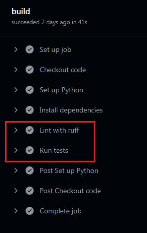

# REST API для учёта и модерации горных перевалов

## Содержание
- [Постановка-задачи](#постановка-задачи)
- [Описание-проекта](#описание-проекта)
- [GitHub-Actions](#github-actions)
- [Настройка-и-запуск](#настройка-и-запуск)
- [Файловая-структура](#файловая-структура)
---

## Стек технологий
**Библиотеки**
- python 3.8
- fastapi 0.115.11
- pydantic 2.10.6
- sqlalchemy 2.0.39
- alembic 1.14.1

**База данных**
- Postgres - для проекта
- SQLite - для автотестов (создается "база в памяти". Просто хотела попробовать такую практику прогона тестов)

---

## Постановка задачи
Федерации Спортивного Туризма России (ФСТР) заказала разработку мобильного приложения для Android и iOS, 
которое упростит туристам задачу по отправке данных о перевале.\
Пользователи мобильного приложения будут вносить данные о перевале, при отправке данных будут
вызваться методы REST API, которые в свою очередь будет вносить изменения в базу данных ФСТР для дальнейшей работы.

---

## Описание проекта
REST API, которое обслуживать мобильное приложение

### Методы API
| Метод |           Эндпоинт            |                                                                        Описание                                                                        |
|:-----:|:-----------------------------:|:------------------------------------------------------------------------------------------------------------------------------------------------------:|
| POST  |          submitData           |                                                               Добавление нового перевала                                                               |
|  GET  |         submitData/id         |                                                        Получение 1 записи (перевала) по его id                                                         |
|  GET  | submitData/?user__email=email |                                            Получить список перевалов конкретного пользователя по его email                                             |
| PATH  |         submitData/id         | Отредактировать (заменить) данные существующего перевала, если зпись в статусе new. Редактировать можно все поля, кроме данных пользователя (User) |

### Примеры запросов
**Добавление перевала**
~~~http
POST /submitData
{
  "beauty_title": "пер. ",
  "title": "Пхия",
  "other_titles": "Триев",
  "connect": "",
  "add_time": "2021-09-22 13:18:13",
  "coords": {
    "latitude": 45.3842,
    "longitude": 7.1525,
    "height": 1200
  },
  "level": {
    "winter": "",
    "summer": "1А",
    "autumn": "1А",
    "spring": ""
  },
  "images": [
     {
      "data": "iVBORw0KGgoANGsrtG95HwlW1akBUYXUggg==", 
      "title": "Пхия"
     },
  ],
  "user": {
    "email": "user@email.tld",
    "fam": "Пупкин",
    "name": "Василий",
    "otc": "Иванович",
    "phone": "79031234567"
  }
}
~~~
**Получение перевала по его id**
~~~http
GET /submitData/1
~~~
**Получить список перевалов конкретного пользователя**
~~~http
GET /submitData/?user__email=user@email.tld
~~~
**Заменить данные о перевале**
~~~http
PATH /submitData/1
{
  "beauty_title": "пер. ",
  "title": "Пхия",
  "other_titles": "Триев",
  "connect": "",
  "add_time": "2021-09-22 13:18:13",
  "coords": {
    "latitude": 45.3842,
    "longitude": 7.1525,
    "height": 1200
  },
  "level": {
    "winter": "",
    "summer": "",
    "autumn": "1А",
    "spring": ""
  },
  "images": [],
}
~~~

**В виде кода**
~~~python
import requests

from src.core.config import app_settings

class PerevalAPI:
    BASE_URL = f'http://{app_settings.app_host}:{app_settings.app_port}/submitData'

    def add_pereval(self, data_pereval: dict) -> dict:
        return requests.post(url=self.BASE_URL, json=data_pereval).json()

    def get_pereval_by_id(self, pereval_id: int) -> dict:
        return requests.get(url=f'{self.BASE_URL}/{pereval_id}').json()

    def edit_pereval_by_id(self, pereval_id: int, data_to_update: dict) -> dict:
        return requests.patch(url=f'{self.BASE_URL}/{pereval_id}', json=data_to_update).json()

    def get_perevals_by_email_user(self, email_user: str) -> list:
        return requests.get(url=f'{self.BASE_URL}', params={'user__email': email_user}).json()

pereval_api = PerevalAPI()
data_pereval = {...}

# Добавить перевал
pereval = pereval_api.add_pereval(data_pereval)

# Получить перевал по id
info_pereval = pereval_api.get_pereval_by_id(pereval['id'])

data_to_update = {...}

# Изменить данные перевала
pereval_api.edit_pereval_by_id(pereval['id'], data_to_update)

# Получить спискок перевалов, добавленных конкретным пользователем
pereval_api.get_perevals_by_email_user(info_pereval['user']['email'])
~~~
---

## GitHub Actions
В workflow текущего проекта настроен только один джоб.\
Джоб срабатывает при каждом коммите или merge request. Он проверяет код при помощи линтера ruff и запускает автотесты

---

## Настройка и запуск
1. Убедитесь, что у вас установлен python версии 3.8.
2. Клонируйте этот репозиторий: `https://github.com/SvetlanaKrasnova/pereval_api.git`
3. Создайте venv. Активируйте и установите необходимые миграции
Либо с помощью pip, либо poetry.
4. Настройте конфиг (.env). Необходимо указать необходимые настройки
5. Выполните миграции
~~~python
alembic upgrade head
~~~
6. Запустите main.py

.env: \
**FSTR_DB_HOST** - путь к базе данных \
**FSTR_DB_PORT** - порт базы данных \
**FSTR_DB_NAME** - наименование базы данных \
**FSTR_DB_LOGIN** - логин, с которым происходит подключение к БД \
**FSTR_DB_PASS** - пароль, с которым происходит подключение к БД \
**APP_PORT** - порт работы приложения (по умолчанию 8000) \
**APP_HOST** - хост работы приложения (по умолчанию localhost)
---
## Файловая структура
~~~python
api_snippet_codes/
├── alembic/
│   ├── ...
├── files_readme/
│   ├── ...
├── alembic.ini
├── logs/
│   ├── ...
├── poetry.lock
├── pyproject.toml
├── README.md
├── src/ # код, который непосредственно относится к приложению
│   ├── api/ # эндпоинты
│   │   └── v1/
│   │       ├── pereval.py
│   ├── core/ # для описания настроек проекта, секретов и настроек сторонних библиотек
│   │   ├── config.py # Настройки проекта
│   │   └── logger.py
│   ├── db/ # настройка и классами для работы с базой данных
│   │   └── db.py
│   ├── app.py # создание приложения FastAPI
│   ├── db_dependency.py # Зависимость с БД
│   ├── exceptions.py
│   ├── main.py
│   ├── models/ # Описание моделий БД
│   │   ├── ...
│   ├── schemas/ # схемы для работы с API
│   │   ├── ...
│   ├── services/ # бизнес-логика приложения по сбору/проверки необходимых данных
│   │   ├── pereval.py
├── conftest.py
├── test_db_pereval.py
├── data_for_tests.py # Данные для тестов
~~~